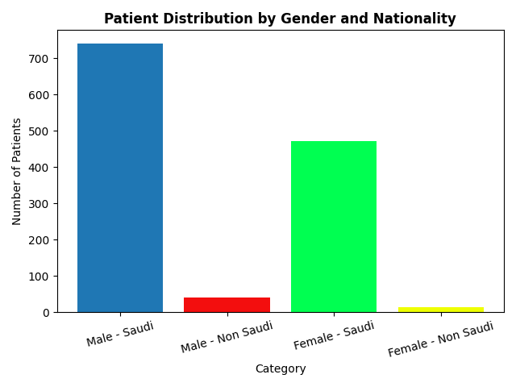
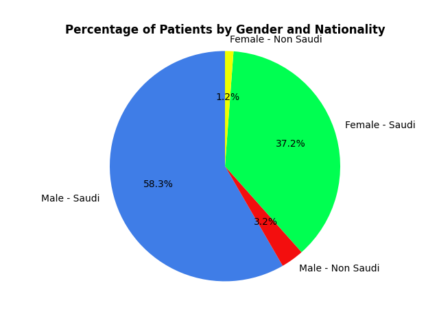
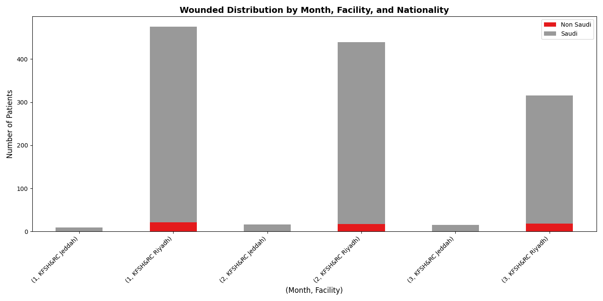

# injured children analytics 2025
Analyzes patient demographic data and visualizes trends by region, facility, department, and nationality over time.

## Background

This project processes health records from a CSV dataset (`data.csv`) to compute patient distributions (such as gender and nationality breakdowns) and generates analytical charts. It provides insights into monthly patient counts and facility-level distributions.

## Data Source and License

The dataset used in this project is sourced from the **Saudi National Open Data Portal** and is published by **King Faisal Specialist Hospital and Research Centre (KFSH&RC)**.

- **Portal**: [Saudi National Open Data Portal](https://open.data.gov.sa)
- **Dataset URL**: [Patient Demographics Dataset](https://open.data.gov.sa/ar/datasets/view/f950475c-ac6b-4f34-8f29-df56c231c55e/resources)
- **License**: [Saudi Arabia Open Data License](https://open.data.gov.sa/odp-public/static/ar/assets/Open_Data_License_Ar.pdf)

This data is provided under the **Saudi Arabia Open Data License** issued by the Saudi Data and AI Authority (SDAIA). By using this project, you agree to the terms of the license. A copy of the license is included in the [LICENSE](LICENSE) file.

### Disclaimer

The data is provided "as is." The publishing government entity is not liable for any damage or loss resulting from the use of this data. There is no guarantee regarding the continued availability or accuracy of the dataset, which may be updated or removed periodically.

### Usage Restrictions

In accordance with the Open Data License, the data must **not** be used:
- For political purposes.
- To support illegal or criminal activity.
- For racist or discriminatory expressions.
- To negatively influence culture or equality, or to provoke any behavior that is illegal or contrary to the customs and traditions of the Kingdom of Saudi Arabia.

## Install

The project requires Python 3 with `pandas` and `matplotlib`.

```bash
# (Optional) Create and activate a virtual environment
python3 -m venv venv
source venv/bin/activate  # On Windows use: venv\Scripts\activate

# Install dependencies
pip install pandas matplotlib
```

## Usage

To run the analysis and display the visualizations, ensure `data.csv` is in the root directory and run the main script:

```bash
python main.py
```

## Visualizations

Below are the plots generated by the demographic analysis:

### Monthly Patient Distribution


### Patient Distribution by Gender and Nationality (Bar Chart)


### Percentage of Patients by Gender and Nationality (Pie Chart)


### Wounded Distribution by Month, Facility, and Nationality

